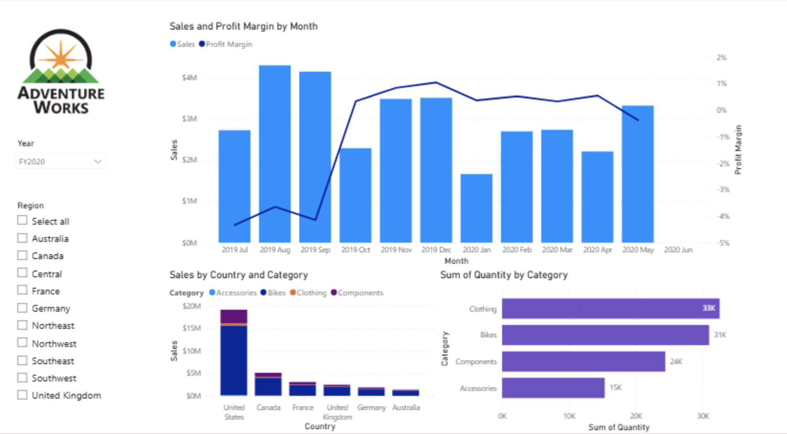
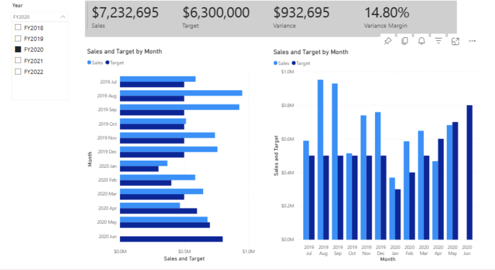
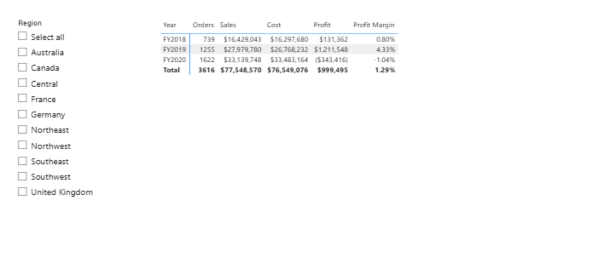

# 📊 Power BI Project – End-to-End Reporting & Dashboard Development

**Author:** Swida Saeed  
**Tool Used:** Microsoft Power BI Desktop  

---

# 📌 Project Overview

This project demonstrates the complete Power BI development lifecycle — from raw data ingestion to interactive executive dashboard creation.

The objective was to:

- Load and transform structured data  
- Build a semantic data model  
- Develop DAX measures  
- Apply time intelligence calculations  
- Design interactive reports  
- Create high-level performance dashboards  

The final solution provides a comprehensive sales and profitability reporting system designed for business decision-making.

---

# 📁 Project File

The complete Power BI project file is available below:

📥 **Power BI Dashboard File:**  
[Adventure_Works_Dashboard.pbix](Adventure_Works_Dashboard.pbix)

*Note: Open using Microsoft Power BI Desktop.*

🧮 **DAX Snippets – Advanced Calculations**  
[05-Snippets.txt](05-Snippets.txt)  
[06-Snippets.txt](06-Snippets.txt)

These snippet files demonstrate:
- Advanced filter context manipulation  
- Percentage of total calculations  
- Time intelligence functions (YTD, YoY)  
- Dynamic measure logic using `VAR` and `DIVIDE()`  

# 🔄 Power BI Development Workflow

### 01 — Get Data  
Import and prepare raw data for analysis.  
• Connect to data sources  
• Import datasets  
• Validate column types  
• Prepare structure for transformation  

---

### 02 — Clean & Transform  
Improve data quality using Power Query.  
• Remove unnecessary columns  
• Rename fields clearly  
• Change data types  
• Filter and clean records  

---

### 03 — Configure Semantic Model  
Build structured relationships between tables.  
• Create table relationships  
• Define one-to-many cardinality  
• Manage cross-filter direction  
• Validate model integrity  

---

### 04 — Create DAX Calculations  
Develop measures and KPIs for reporting.  
• Create Sales, Cost, Profit measures  
• Build KPI metrics  
• Apply aggregation functions  

---

### 05 — Modify Filter Context  
Control how calculations respond to filters.  
• Use `CALCULATE()`  
• Apply custom filter logic  
• Manage row vs filter context  

---

### 06 — Apply Time Intelligence  
Perform period-based trend analysis.  
• Year-to-Date (YTD)  
• Month-to-Date (MTD)  
• Previous Year comparisons  

---

### 07 — Create Visual Calculations  
Present insights using interactive visuals.  
• KPI cards  
• Bar and column charts  
• Line charts  
• Tables and slicers  

---

### 08 — Design & Enhance Reports  
Improve usability and storytelling.  
• Refine layout and spacing  
• Apply consistent formatting  
• Optimise report flow  

---

### 09 — Create Dashboards  
Develop executive dashboards for performance monitoring.  
• Pin key visuals from reports  
• Display KPI summaries  
• Enable interactive filtering  
• Provide performance overview  

---

# 📈 Dashboard Overview

The final dashboard provides interactive reporting across sales performance, profitability, and target tracking.

---

## Sales & Performance Overview

High-level KPI summary with trend analysis and regional breakdown.

---

## Sales vs Target Analysis

Comparison of actual sales against targets with variance calculations and performance trends.

---

## Profit & Margin Analysis

Breakdown of sales, cost, profit, and profit margin across financial years.

---

# 🧮 DAX Measures Developed

- Total Sales  
- Total Cost  
- Profit  
- Profit Margin %  
- Target  
- Variance (Sales – Target)  
- Variance Margin %  
- Year-to-Date (YTD)  
- Month-to-Date (MTD)  
- Previous Year Comparisons  

---

# 🎯 Skills Demonstrated

- Data ingestion & transformation  
- Power Query data cleaning  
- Semantic model configuration  
- Relationship management  
- Advanced DAX calculations  
- Filter context manipulation  
- Time intelligence functions  
- Interactive report design  
- Executive dashboard development  
- Business performance storytelling  

---

# 📊 Business Value

This solution enables:

- Executive-level performance monitoring  
- Sales vs target evaluation  
- Profitability tracking  
- Regional and category comparison  
- Financial trend analysis  
- Data-driven decision-making  

---

# 🚀 Outcome

This project demonstrates the ability to build a complete Power BI reporting solution using structured modelling, DAX, and interactive dashboard design to deliver actionable business insights.
  
